# [NmapStack](https://github.com/maravento)

[](https://github.com/maravento/vault)

<!-- markdownlint-disable MD033 -->

<table width="100%">
  <tr>
    <td style="width: 50%; vertical-align: top;">
    NmapStack is a zero-knowledge network scanning and auditing toolkit built around Nmap. It discovers, analyzes, and monitors network devices, services, and ports. Its results help assess a network's status and exposure through on-demand audits or continuous monitoring. No agents or software need to be installed on audited devices.
    </td>
    <td style="width: 50%; vertical-align: top;">
    NmapStack es un conjunto de herramientas de escaneo y auditoría de redes de conocimiento cero, basado en Nmap. Permite descubrir, analizar y supervisar dispositivos, servicios y puertos. Sus resultados ayudan a evaluar el estado y la exposición de una red mediante auditorías puntuales o supervisión continua. No requiere instalar agentes ni software en los equipos auditados.
    </td>
  </tr>
</table>

## Repository Structure

---

```
nmapstack/
├── linux/                   # LINUX — on-demand scan-and-report tool
│   └── nreport.sh
│
├── nwatch/                  # WEB — live web dashboard
│   ├── nwatchsetup.sh         # Installer: --install|--update|--uninstall|--status
│   │
│   ├── tools/               # Background daemons for LAN/port scanning
│   │   ├── nwatchlan.sh       # LAN discovery daemon (arp-scan)
│   │   └── nwatchports.sh     # Port auditing daemon (ss / nmap) + mode CLI
│   │
│   └── web/                 # Web dashboard front-end (LAN/Ports tabs)
│       ├── index.php          # Main page (LAN / Ports tabs)
│       ├── lan.html           # LAN devices viewer
│       ├── nwatch.conf        # Apache vhost (:3126/?tab=lan and :3126/?tab=ports)
│       ├── nwatchapi.php      # JSON API (devices, ports, mode switch)
│       └── ports.html         # Ports viewer + Server/Target mode selector
│
└── win/                     # Windows package metadata (Nscan is hosted on mega.nz)
    ├── changelog.txt          # Version history
    └── nscan.exe.sha256       # Checksum for Nscan
```

## NMAPSTACK

---

### WINDOWS (Nscan)

---

#### Data Sheet

| File |  OS  | Size |
| :--: | :--: | :--: |
| [nscan.exe (.zip)](https://mega.nz/file/3M0jiCJZ#mjpJLQyi1kKmx7M9R6FiUBGV9Z9NajebQIcYCc7tk08) | Windows 10/11 x64 | 44.4 MB |

#### Package Contents

- [nmap](https://nmap.org/download#windows)
- [npcap](https://nmap.org/download#windows)
- [libxslt (xsltproc)](https://www.zlatkovic.com/pub/libxml/)
- [Microsoft Visual C++ Runtimes](https://gitlab.com/stdout12/vcredist/-/releases)

#### How to Use

<table width="100%">
  <tr>
    <td style="width: 50%; vertical-align: top;">
     Temporarily disable your antivirus, antimalware, SmartScreen, or other operating system security software. Close all windows and make sure your PC's date and time are correct. Unzip <code>nscan.exe (.zip)</code> to your desktop. Double-click the file, allow it to run with elevated privileges, and follow the on-screen instructions.
    </td>
    <td style="width: 50%; vertical-align: top;">
     Desactive temporalmente el antivirus, antimalware, SmartScreen o cualquier otra solución de seguridad del sistema operativo. Cierre todas las ventanas y verifique que la fecha y la hora de su PC sean correctas. Descomprima <code>nscan.exe (.zip)</code> en el escritorio. Haga doble clic en el archivo, acepte la ejecución con privilegios y siga las instrucciones en pantalla.
    </td>
  </tr>
</table>

> This is recommended because the project packages batch scripts in an .exe, which antivirus software may flag as a false positive. If you have concerns, unzip the .exe and review the scripts, run the packages manually, or choose not to use the project.
>
> Se recomienda hacerlo porque el proyecto empaqueta scripts batch en un .exe, que los antivirus podrían marcar por error. Si tiene dudas, puede descomprimir el .exe y revisar los scripts, ejecutar los paquetes manualmente o no usar este proyecto.

#### ⚠️ WARNING

<table width="100%">
  <tr>
    <td style="width: 50%; vertical-align: top;">
     <strong>Before continuing:</strong> If Nmap or Npcap is already installed on your PC, uninstall it before using this tool to avoid version conflicts.
    </td>
    <td style="width: 50%; vertical-align: top;">
     <strong>Antes de continuar:</strong> Si Nmap o Npcap ya está instalado en su PC, desinstálelo antes de usar esta herramienta para evitar conflictos de versiones.
    </td>
  </tr>
</table>

#### Start

<table width="100%">
  <tr>
    <td style="width: 50%; vertical-align: top;">
     When the program starts, it asks you to connect to your data network. Press OK to continue or Cancel to abort.
    </td>
    <td style="width: 50%; vertical-align: top;">
     Al iniciar, el programa le pedirá que se conecte a la red de datos. Presione OK para continuar o Cancel para abortar.
    </td>
  </tr>
</table>

[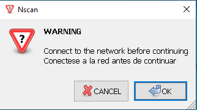](https://www.maravento.com)

#### Scan Selector

<table width="100%">
  <tr>
    <td style="width: 50%; vertical-align: top;">
     Select the scan mode. Press OK to continue or Cancel to abort.
    </td>
    <td style="width: 50%; vertical-align: top;">
     Seleccione el modo de escaneo. Presione OK para continuar o Cancel para abortar.
    </td>
  </tr>
</table>

[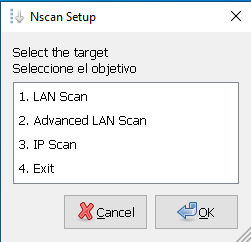](https://www.maravento.com)

#### Scanning Modes

| Scan Mode | Nmap Options | Description | Descripción |
| --------- | ------------ | ----------- | ----------- |
| 1. LAN Scan | `-sS -T4 -F -sV` | Fast network scan with service detection | Escaneo rápido de red con detección de servicios |
| 2. Advanced LAN Scan | `-sS -T4 -p- -sV -sC --max-retries 3 --host-timeout 5m` | In-depth scan of all ports with scripts | Escaneo detallado de todos los puertos con scripts |
| 3. IP Scan | `-Pn -sS -T4 -p- -sV --version-intensity 8 -sC -O --script vuln --traceroute -oA scan_ip --max-retries 3 --host-timeout 10m` | Comprehensive audit of one host, including OS detection, vulnerability scanning, and detailed service enumeration | Auditoría completa de un host con detección del sistema operativo, búsqueda de vulnerabilidades y enumeración detallada de servicios |

#### Installation Messages

<table width="100%">
  <thead>
    <tr>
      <th width="250">Message</th>
      <th>Description</th>
      <th>Descripción</th>
    </tr>
  </thead>
  <tbody>
    <tr>
      <td width="250">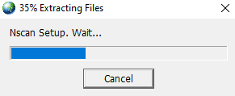</td>
      <td>Extracting Nscan files during setup.</td>
      <td>Extrayendo los archivos de Nscan durante la instalación.</td>
    </tr>
    <tr>
      <td width="250">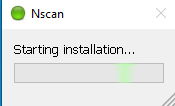</td>
      <td>Installing the Microsoft Visual C++ runtimes.</td>
      <td>Instalando los runtimes de Microsoft Visual C++.</td>
    </tr>
  </tbody>
</table>

#### Scan Messages

<table width="100%">
  <thead>
    <tr>
      <th width="250">Message</th>
      <th>Description</th>
      <th>Descripción</th>
    </tr>
  </thead>
  <tbody>
    <tr>
      <td width="250">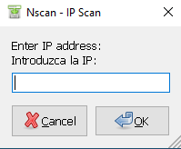</td>
      <td>Option 3: Scan a single IPv4 address. IP ranges are not accepted.</td>
      <td>Opción 3: Escanea una dirección IPv4 específica. No se aceptan rangos.</td>
    </tr>
    <tr>
      <td width="250">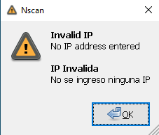</td>
      <td>The entered IPv4 address is invalid.</td>
      <td>La dirección IPv4 ingresada no es válida.</td>
    </tr>
    <tr>
      <td width="250">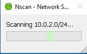</td>
      <td>Scanning the IP address or network.</td>
      <td>Escaneando la dirección IP o la red.</td>
    </tr>
    <tr>
      <td width="250">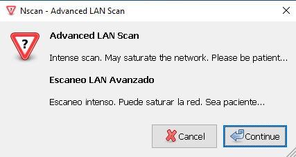</td>
      <td>Running an intensive scan.</td>
      <td>Ejecutando un escaneo intensivo.</td>
    </tr>
    <tr>
      <td width="250">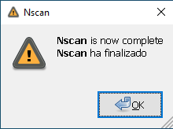</td>
      <td>The scan completed successfully.</td>
      <td>El escaneo finalizó correctamente.</td>
    </tr>
  </tbody>
</table>

#### Error Messages

<table width="100%">
  <thead>
    <tr>
      <th width="250">Message</th>
      <th>Description</th>
      <th>Descripción</th>
    </tr>
  </thead>
  <tbody>
    <tr>
      <td width="250">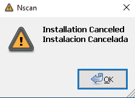</td>
      <td>You clicked "Cancel" or an error occurred during installation.</td>
      <td>Hizo clic en "Cancelar" o ocurrió un error durante la instalación.</td>
    </tr>
    <tr>
      <td width="250">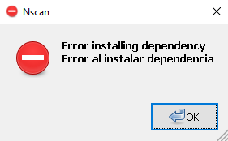</td>
      <td>A dependency could not be installed.</td>
      <td>No se pudo instalar una dependencia.</td>
    </tr>
    <tr>
      <td width="250">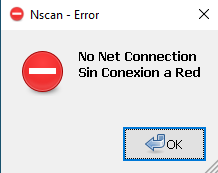</td>
      <td>No internet connectivity detected.</td>
      <td>No se detectó conectividad a internet.</td>
    </tr>
    <tr>
      <td width="250">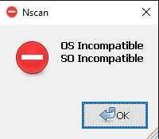</td>
      <td>The installer is running on an incompatible operating system.</td>
      <td>El instalador se está ejecutando en un sistema operativo incompatible.</td>
    </tr>
  </tbody>
</table>

#### Npcap

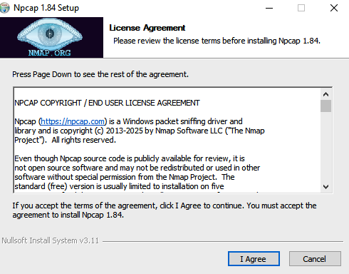

<table width="100%">
  <tr>
    <td style="width: 50%; vertical-align: top;">
     Nscan requires Npcap, which is available in a free version. The installer does not install it automatically because the free version is not an OEM version and does not support silent installation with the <code>/S</code> option. When prompted, complete the Npcap installation manually. The free version can be used on up to 5 machines. For details, see <a href="https://npcap.com/oem/">Npcap OEM</a>.
    </td>
    <td style="width: 50%; vertical-align: top;">
     Nscan requiere Npcap, disponible en una versión gratuita. El instalador no lo instala automáticamente porque esa versión no es OEM y no admite instalaciones silenciosas con la opción <code>/S</code>. Cuando el instalador se lo solicite, complete la instalación de Npcap manualmente. La versión gratuita puede usarse en hasta 5 equipos. Para más información, consulte <a href="https://npcap.com/oem/">Npcap OEM</a>.
    </td>
  </tr>
</table>

#### Report

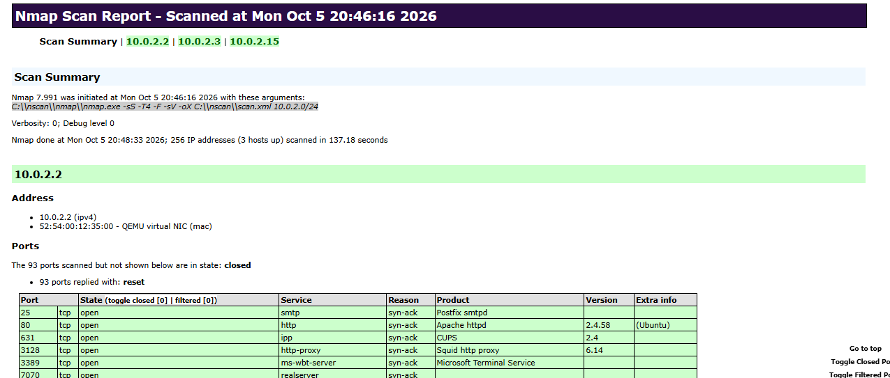

<table width="100%">
  <tr>
    <td style="width: 50%; vertical-align: top;">
     Nscan saves scan reports in the <code>Desktop\Report</code> folder, according to the scan type. Each report includes a timestamp with the date and time of the scan.
    </td>
    <td style="width: 50%; vertical-align: top;">
     Nscan guarda los informes de escaneo en la carpeta <code>Desktop\Report</code>, según el tipo de escaneo. Cada archivo incluye la fecha y la hora en que se ejecutó el escaneo.
    </td>
  </tr>
</table>

#### Telemetry

<table width="100%">
  <tr>
    <td style="width: 50%; vertical-align: top;">
     Nscan sends the developer information only to confirm that installation completed successfully. The information is used for statistics and to improve the installer. It does not include personal data. Example:
    </td>
    <td style="width: 50%; vertical-align: top;">
     Nscan solo envía información al desarrollador para confirmar que la instalación finalizó correctamente. Esta información sirve para elaborar estadísticas y mejorar el instalador. No incluye datos personales. Ejemplo:
    </td>
  </tr>
</table>

```bash
Package Installation
Hostname=DESKTOP-XXXXXXX
User=User
Date=mié. 13/11/2024 Time= 6:44:17,39
Status=Installed
Package: Nscan
```

#### Packages and Tools

- [7zSFX Builder](https://sourceforge.net/projects/s-zipsfxbuilder/)
- [curl for Windows](https://curl.se/windows/)
- [libxslt (xsltproc)](https://www.zlatkovic.com/pub/libxml/)
- [nmap](https://nmap.org/download#windows)
- [npcap](https://nmap.org/download#windows)
- [Quick Batch File Compiler](https://www.abyssmedia.com/quickbfc/)
- [RapidCRC Unicode](https://www.ov2.eu/programs/rapidcrc-unicode)
- [vcredist](https://gitlab.com/stdout12/vcredist/-/releases)
- [WinZenity](https://github.com/maravento/vault/tree/master/winzenity)

### LINUX (nreport.sh)

---

<table width="100%">
  <tr>
    <td style="width: 50%; white-space: nowrap; vertical-align: top; padding-right: 10px;">
      <p><strong>Nreport can run on Linux with the same scan modes:</strong></p>
      <p>
        1. <code>LAN Scan</code><br>
        2. <code>Advanced LAN Scan</code><br>
        3. <code>IP/Host Scan</code>
      </p>
      <p>
        Nreport saves scan reports in the <code>/home/$USER/Report</code> folder,
        according to the scan type.<br> Each report includes a timestamp
        with the date and time of the scan.
      </p>
    </td>
    <td style="width: 50%; white-space: nowrap; vertical-align: top; padding-left: 10px;">
      <p><strong>Nreport puede ejecutarse en Linux con los mismos modos de escaneo:</strong></p>
      <p>
        1. <code>LAN Scan</code><br>
        2. <code>Advanced LAN Scan</code><br>
        3. <code>IP/Host Scan</code>
      </p>
      <p>
        Nreport guarda los informes de escaneo en la carpeta <code>/home/$USER/Report</code>,
        según el tipo de escaneo.<br> Cada informe incluye la fecha y la hora
        en que se ejecutó el escaneo.
      </p>
    </td>
  </tr>
</table>

#### Requirements

**⚠️ WARNING:** Tested on Ubuntu 24.04/26.04 LTS. Use on other versions or distributions is at your own risk.

- nmap, xsltproc, iproute2, util-linux

```bash
apt-get install -y nmap xsltproc iproute2 util-linux
```

<table width="100%">
  <tr>
    <td style="width: 50%; vertical-align: top;">
      <code>nreport.sh</code> checks these dependencies at startup. If one is missing, it stops and displays a clear message. Install them beforehand to avoid that extra step.
    </td>
    <td style="width: 50%; vertical-align: top;">
      <code>nreport.sh</code> verifica estas dependencias al iniciar. Si falta alguna, se detiene y muestra un mensaje claro. Instálelas de antemano para evitar ese paso adicional.
    </td>
  </tr>
</table>

```bash
wget -q https://raw.githubusercontent.com/maravento/vault/master/nmapstack/linux/nreport.sh -O nreport.sh
chmod +x nreport.sh
sudo ./nreport.sh
```

### WEB (nwatch)

---

[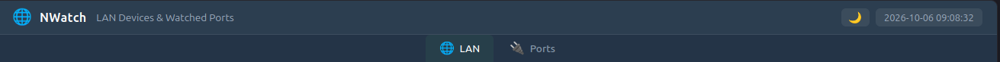](https://www.maravento.com)

<table width="100%">
  <tr>
    <td style="width: 50%; vertical-align: top;">
    NWatch is a live web dashboard for auditing LAN devices and ports on Linux. It runs independently of the on-demand Windows and Linux scan-and-report tools described above. Two background daemons provide the data: one discovers LAN devices with periodic <code>arp-scan</code> runs; the other audits TCP and UDP ports in one of two modes. <strong>Server</strong> mode (the default) reads the server's listening sockets without probing. <strong>Target</strong> mode scans a selected external host with Nmap in near real time. Only one port mode runs at a time, keeping results from the two sources separate. The dashboard is available at <code>localhost</code> and has two tabs: <strong>LAN</strong> shows devices and their online/offline status; <strong>Ports</strong> shows open and closed ports for the server or target. History is stored in a local SQLite database.
    </td>
    <td style="width: 50%; vertical-align: top;">
    NWatch es un panel web para auditar dispositivos LAN y puertos en Linux. Funciona de forma independiente de las herramientas de escaneo e informes bajo demanda para Windows y Linux descritas arriba. Dos demonios en segundo plano recopilan los datos: uno descubre dispositivos LAN mediante ejecuciones periódicas de <code>arp-scan</code>; el otro audita puertos TCP y UDP en uno de dos modos. El modo <strong>Server</strong> (predeterminado) lee los sockets en escucha del servidor sin sondearlos. El modo <strong>Target</strong> escanea casi en tiempo real un host externo seleccionado mediante Nmap. Solo se ejecuta un modo de puertos a la vez, para mantener separados los resultados de ambas fuentes. El panel está disponible en <code>localhost</code> y tiene dos pestañas: <strong>LAN</strong> muestra los dispositivos y su estado online/offline; <strong>Ports</strong> muestra los puertos abiertos y cerrados del servidor o del host seleccionado. El historial se guarda en una base de datos SQLite local.
    </td>
  </tr>
</table>

[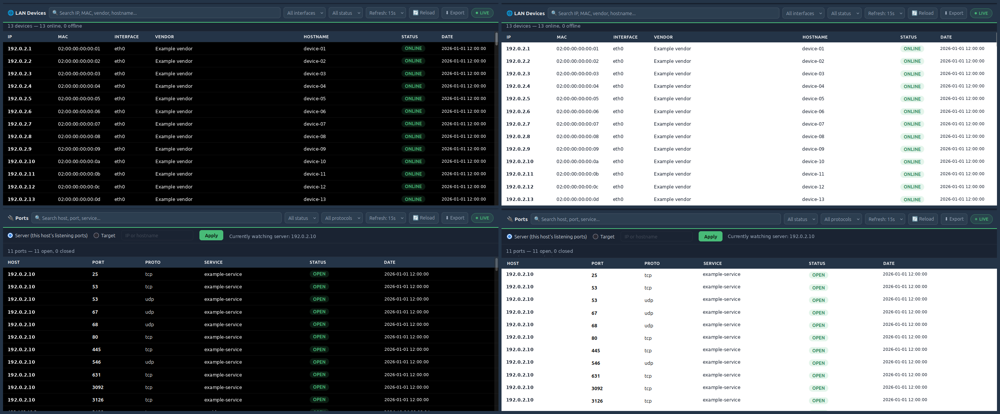](https://www.maravento.com)

#### Runtime Files

<table width="100%">
  <tr>
    <td style="width: 50%; vertical-align: top;">
      Files and directories created at runtime. They are not included in the repository. See <a href="#repository-structure">Repository Structure</a> for the files included in the project:
    </td>
    <td style="width: 50%; vertical-align: top;">
      Archivos y directorios creados durante la ejecución. No están incluidos en el repositorio. Consulte <a href="#repository-structure">Estructura del repositorio</a> para ver los archivos incluidos en el proyecto:
    </td>
  </tr>
</table>

```
/etc/nwatch/                # Read-only config (750 root:www-data), same model as proxymon's /etc/proxymon
└── nwatch.env                # Install config: interfaces, network, server IP, poll intervals
                              # (640 root:www-data — web reads, never writes)

/var/www/nwatch/data/       # Web-writable state (775 www-data:www-data)
├── nwatch.db                 # SQLite database (WAL mode)
├── ports_mode.conf           # Active ports mode + target IP
│                             # (664 www-data:www-data — web rewrites in place)
└── port_scan_status.conf     # Last completed poll cycle (source, host, time, ports found)
                              # (664 www-data:www-data — nwatchports.sh rewrites every cycle)

/run/                       # PID files, used by start/stop/status
├── nwatchlan.pid             # nwatchlan.sh
└── nwatchports.pid           # nwatchports.sh

/var/log/nwatch.log         # Shared by both daemons
/etc/logrotate.d/nwatch     # Weekly rotation for the shared log

/etc/cron.d/nwatch          # All cron entries of the project, one file
```

> `nwatchsetup.sh` stores all project cron jobs in `/etc/cron.d/nwatch`. Adding or removing a job changes only that file, leaving other projects' cron jobs untouched. `--uninstall` removes the file. Earlier installations keep their jobs in root's crontab. The installer removes them by matching the full script path.
>
> `nwatchsetup.sh` guarda todas las tareas cron del proyecto en `/etc/cron.d/nwatch`. Al agregar o quitar una tarea, solo modifica ese archivo; las tareas de otros proyectos quedan intactas. `--uninstall` elimina el archivo. Las instalaciones anteriores guardan sus tareas en el crontab de root. El instalador las elimina al identificar la ruta completa del script.

#### Requirements

**⚠️ WARNING:** Tested on Ubuntu 24.04/26.04 LTS. Use on other versions or distributions is at your own risk.

- Apache2 with mod_php (not PHP-FPM — the vhost uses `SetHandler application/x-httpd-php`)
- arp-scan, sqlite3, php-sqlite3, php-cli, nmap, iproute2 (`ss`), logrotate, util-linux

```bash
apt-get install -y apache2 libapache2-mod-php php-cli
apt-get install -y arp-scan sqlite3 php-sqlite3 nmap iproute2 logrotate util-linux
```

<table width="100%">
  <tr>
    <td style="width: 50%; vertical-align: top;">
      <strong>Optional:</strong> <code>avahi-utils</code> (mDNS) and <code>nbtscan</code> (NetBIOS) can improve the <code>Hostname</code> column on the LAN tab when a device has no reverse-DNS record. This is common for consumer and IoT devices on home networks. Neither package is required. If they are absent, <code>nwatchlan.sh</code> uses DNS resolution only.
    </td>
    <td style="width: 50%; vertical-align: top;">
      <strong>Opcional:</strong> <code>avahi-utils</code> (mDNS) y <code>nbtscan</code> (NetBIOS) pueden mejorar la columna <code>Hostname</code> de la pestaña LAN cuando un dispositivo no tiene un registro DNS reverso. Esto es común en equipos de consumo y dispositivos IoT de redes domésticas. Ninguno es obligatorio. Si no están instalados, <code>nwatchlan.sh</code> usa solo la resolución DNS.
    </td>
  </tr>
</table>

```bash
apt-get install -y avahi-utils nbtscan
```

<table width="100%">
  <tr>
    <td style="width: 50%; vertical-align: top;">
      <strong>Important</strong>
      <ul>
        <li><code>nginx</code>, <code>lighttpd</code> and <code>caddy</code> must not be installed.</li>
        <li>The web panel listens on port <code>3126</code>, registered by <a href="https://www.iana.org/assignments/service-names-port-numbers/service-names-port-numbers.txt">IANA</a> as Unassigned.</li>
      </ul>
    </td>
    <td style="width: 50%; vertical-align: top;">
      <strong>Importante</strong>
      <ul>
        <li><code>nginx</code>, <code>lighttpd</code> y <code>caddy</code> no deben estar instalados.</li>
        <li>El panel web escucha en el puerto <code>3126</code>, registrado por <a href="https://www.iana.org/assignments/service-names-port-numbers/service-names-port-numbers.txt">IANA</a> como Sin asignar.</li>
      </ul>
    </td>
  </tr>
</table>

#### HOW TO USE

##### Install

```bash
git clone --depth=1 https://github.com/maravento/vault.git
cd vault/nmapstack/nwatch
sudo bash nwatchsetup.sh --install

# or

wget -qO gitfolder.py https://raw.githubusercontent.com/maravento/vault/master/scripts/python/gitfolder.py
chmod +x gitfolder.py
python3 gitfolder.py https://github.com/maravento/vault/nmapstack
cd nmapstack/nwatch
sudo bash nwatchsetup.sh --install
```

<table width="100%">
  <tr>
    <td style="width: 50%; vertical-align: top;">
      The installer lists physical network interfaces with a global IPv4 address. Virtual and loopback interfaces are hidden; see below. It then asks for two selections. First, choose one or more <strong>scan interfaces</strong> by entering their numbers, separated by commas (for example, <code>1,2</code>). This is useful on servers with both LAN and WAN interfaces because <code>nwatchlan.sh</code> scans each selected interface during every cycle. Next, choose one <strong>management interface</strong>. The web panel uses this interface's IP address to authorize access, so choose your LAN or admin interface, never WAN. The installer then deploys the web dashboard and both daemons, and starts them automatically. These daemons are required by the dashboard, unlike the optional watchdog.
    </td>
    <td style="width: 50%; vertical-align: top;">
      El instalador muestra las interfaces físicas que tienen una dirección IPv4 global. Las interfaces virtuales y loopback se ocultan; consulte la sección siguiente. Luego solicita dos selecciones. Primero, elija una o más <strong>interfaces de escaneo</strong> e ingrese sus números separados por comas (por ejemplo, <code>1,2</code>). Esto es útil en servidores con interfaces LAN y WAN, porque <code>nwatchlan.sh</code> escanea cada interfaz seleccionada en todos los ciclos. Después, elija una sola <strong>interfaz de gestión</strong>. El panel usa la dirección IP de esa interfaz para autorizar el acceso; elija una interfaz LAN o de administración, nunca la WAN. Por último, el instalador implementa el panel web y los dos demonios, y los inicia automáticamente. Estos demonios son necesarios para el panel; el watchdog es opcional.
    </td>
  </tr>
</table>

<table width="100%">
  <tr>
    <td style="width: 50%; vertical-align: top;">
      Interfaces named <code>lo</code>, <code>docker*</code>, <code>br-*</code>, <code>veth*</code>, <code>virbr*</code>, <code>tun*</code>, <code>tap*</code>, or <code>wg*</code> are excluded from both selectors. They are not useful <code>arp-scan</code> targets and would clutter the list on servers running Docker, libvirt, or a VPN.
    </td>
    <td style="width: 50%; vertical-align: top;">
      Las interfaces llamadas <code>lo</code>, <code>docker*</code>, <code>br-*</code>, <code>veth*</code>, <code>virbr*</code>, <code>tun*</code>, <code>tap*</code> o <code>wg*</code> se excluyen de ambos selectores. No sirven como objetivos de <code>arp-scan</code> y llenarían la lista en servidores con Docker, libvirt o VPN.
    </td>
  </tr>
</table>

##### Update & Uninstall

```bash
cd vault/nmapstack/nwatch
sudo bash nwatchsetup.sh --update
# or | o
sudo bash nwatchsetup.sh --uninstall
```

| File | `--update` | `--uninstall` |
|------|-----------|---------------|
| `web/nwatch.conf` | ⛔ not touched (user-customized) | ✅ removed |
| `web/index.php`, `lan.html`, `ports.html`, `nwatchapi.php` | ✅ overwritten | ✅ removed |
| `tools/nwatchlan.sh`, `tools/nwatchports.sh` | ✅ overwritten (daemons restarted) | ✅ removed (daemons stopped) |
| `/etc/nwatch/nwatch.env` | ⛔ preserved | ✅ removed |
| `/var/www/nwatch/data/nwatch.db`, `ports_mode.conf`, `port_scan_status.conf` | ⛔ preserved | ✅ removed |

##### Status

```bash
sudo bash nwatchsetup.sh --status
```

Displays the daemon status (running or stopped), Apache's port (3126), the last 10 lines of the shared log, the active ports mode and target, and device and port counts from the database.

##### LAN Field Reference

<table width="100%">
  <tr>
    <td style="width: 50%; vertical-align: top;">
      These are the <code>Vendor</code> and <code>Hostname</code> values shown when NWatch cannot resolve a value. Vendor data comes from <code>arp-scan</code>'s MAC OUI lookup. Hostname resolution uses DNS, mDNS, and NetBIOS:
    </td>
    <td style="width: 50%; vertical-align: top;">
      Estos son los valores de <code>Vendor</code> y <code>Hostname</code> cuando NWatch no puede resolverlos. El fabricante se obtiene del lookup OUI de MAC de <code>arp-scan</code>. La resolución del nombre usa DNS, mDNS y NetBIOS:
    </td>
  </tr>
</table>

| Value | Meaning |
|-------|---------|
| `(Unknown)` | The MAC has a real, manufacturer-assigned OUI, but it isn't in `arp-scan`'s vendor database (`ieee-oui.txt`). |
| `(Unknown: locally administered)` | The MAC's "locally administered" bit is set — it was never assigned by a manufacturer at all (common with Wi-Fi privacy MAC randomization, VMs, containers). There's no vendor to look up. |
| `-` (Hostname) | Reverse DNS, mDNS, and NetBIOS (the ones installed) all failed to resolve a name for that IP. |

##### Export

<table width="100%">
  <tr>
    <td style="width: 50%; vertical-align: top;">
      The <strong>LAN</strong> and <strong>Ports</strong> tabs each have an <code>⬇ Export</code> button. It downloads the visible rows in CSV, Excel, or JSON format, after search and filters, in the current sort order. Export runs in the browser and sends no request to the server.
    </td>
    <td style="width: 50%; vertical-align: top;">
      Las pestañas <strong>LAN</strong> y <strong>Ports</strong> tienen un botón <code>⬇ Export</code>. Permite descargar las filas visibles en formato CSV, Excel o JSON, después de aplicar la búsqueda y los filtros, y en el orden actual. La exportación se ejecuta en el navegador y no envía solicitudes al servidor.
    </td>
  </tr>
</table>

<p align="center">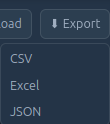<br>Export menu: CSV, Excel, and JSON.<br>Menú de exportación: CSV, Excel y JSON.</p>

##### Ports Modes

<table width="100%">
  <tr>
    <td style="width: 50%; vertical-align: top;">
      The Ports tab audits TCP and UDP ports in one of two modes. Switch modes with the browser's mode selector and Apply button, or from the command line. Only one mode runs at a time. Switching preserves the other mode's history but stops polling it.
    </td>
    <td style="width: 50%; vertical-align: top;">
      La pestaña Ports audita puertos TCP y UDP en uno de dos modos. Puede cambiar de modo con el selector y el botón Apply del navegador, o desde la línea de comandos. Solo se ejecuta un modo a la vez. Al cambiar, se conserva el historial del otro modo, pero deja de actualizarse.
    </td>
  </tr>
</table>

| Mode | Default | What it does | Poll method |
|------|---------|---------------|-------------|
| **Server** | ✅ yes | Watches this server's own listening TCP and UDP ports | `ss -tulnp` (reads the kernel's socket table directly — not a scan, always accurate, includes the owning process) |
| **Target** | no | Watches a single external host you choose | `nmap -Pn -sT -sU -F --host-timeout 60s` (top ~100 common TCP + UDP ports, skips host-discovery so a target dropping ICMP still gets scanned) every poll cycle |

##### Switching Modes

```bash
sudo /var/www/nwatch/tools/nwatchports.sh mode server
sudo /var/www/nwatch/tools/nwatchports.sh mode target 192.168.1.10
sudo /var/www/nwatch/tools/nwatchports.sh list
```

<table width="100%">
  <tr>
    <td style="width: 50%; vertical-align: top;">
      Clicking Apply (or running <code>mode target</code>) writes the new mode or target to <code>ports_mode.conf</code>; it does not start a scan immediately. The background loop in <code>nwatchports.sh</code> reads the change on its next cycle, after up to <code>PORT_POLL_INTERVAL</code> (30 seconds by default). The table may remain empty during that time. The browser's <code>Refresh: 15s</code> setting controls a separate poll of the database; it does not run the scan.
    </td>
    <td style="width: 50%; vertical-align: top;">
      Al hacer clic en Apply (o ejecutar <code>mode target</code>), se guarda el nuevo modo o destino en <code>ports_mode.conf</code>; el escaneo no comienza de inmediato. El ciclo en segundo plano de <code>nwatchports.sh</code> lee el cambio en el siguiente intervalo, que puede tardar hasta <code>PORT_POLL_INTERVAL</code> (30 segundos por defecto). Durante ese tiempo, la tabla puede aparecer vacía. El ajuste <code>Refresh: 15s</code> del navegador actualiza por separado los datos de la base de datos; no ejecuta el escaneo.
    </td>
  </tr>
  <tr>
    <td style="width: 50%; vertical-align: top;">
      <strong>Total time (Target mode):</strong> The daemon may take up to <code>PORT_POLL_INTERVAL</code> (30 seconds by default) to read the new target. The <code>nmap</code> scan then runs. It may take seconds for a responsive host, but UDP scans can take longer if the host silently drops probes. The <code>--host-timeout</code> option caps a scan at 60 seconds so one cycle cannot delay the next. The browser may then take up to one refresh interval to show the results. A heavily filtered target can take nearly two minutes from start to display.
    </td>
    <td style="width: 50%; vertical-align: top;">
      <strong>Tiempo total (modo Target):</strong> el demonio puede tardar hasta <code>PORT_POLL_INTERVAL</code> (30 segundos por defecto) en leer el nuevo destino. Después se ejecuta el escaneo de <code>nmap</code>. Puede tardar unos segundos con un host que responde, pero el escaneo UDP puede demorar más si el host descarta los sondeos sin responder. La opción <code>--host-timeout</code> limita cada escaneo a 60 segundos para que un ciclo no retrase el siguiente. Luego, el navegador puede tardar hasta un intervalo de actualización en mostrar los resultados. Con un destino muy filtrado, el proceso completo puede tardar casi dos minutos.
    </td>
  </tr>
  <tr>
    <td style="width: 50%; vertical-align: top;">
      <strong>ICMP is not required (Target mode).</strong> The scan uses <code>-Pn</code>, which skips host discovery and ping. The target's firewall does not need to allow ICMP echo for port detection; TCP and UDP probes are sent directly.
    </td>
    <td style="width: 50%; vertical-align: top;">
      <strong>No se requiere ICMP (modo Target).</strong> El escaneo usa <code>-Pn</code>, que omite el descubrimiento del host y el ping. El firewall del destino no necesita permitir ICMP echo para detectar sus puertos; los sondeos TCP y UDP se envían directamente.
    </td>
  </tr>
</table>

| Empty-table message | When it shows |
|----------------------|---------------|
| `Scanning ports. Wait...` | Right after clicking Apply, until the first row for the new mode/target arrives. |
| `No Open Ports` | Table is empty and either no mode/target was just applied, or `nwatchports.sh` confirmed a completed scan (via `port_scan_status.conf`) that found nothing. |
| `No ports match the current filters` | There is data, but the search box or Status/Protocol filters exclude every row. |

##### Port Scan Results

<table width="100%">
  <tr>
    <td style="width: 50%; vertical-align: top;">
      In Target mode, NWatch shows a scan summary and the ports reported by Nmap. If the scan finds no open ports, the table displays <code>No Open Ports</code>. Otherwise, each row shows the host, port, protocol, detected service, status, and scan time.
    </td>
    <td style="width: 50%; vertical-align: top;">
      En modo Target, NWatch muestra un resumen del escaneo y los puertos reportados por Nmap. Si no hay puertos abiertos, la tabla muestra <code>No Open Ports</code>. Si se encuentran puertos, cada fila indica el host, el puerto, el protocolo, el servicio detectado, el estado y la hora del escaneo.
    </td>
  </tr>
</table>

<table width="100%">
  <tr>
    <td style="width: 50%; vertical-align: top; text-align: center;">
      <strong>No open ports / Sin puertos abiertos</strong><br>
      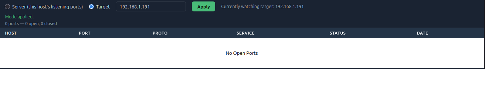
    </td>
    <td style="width: 50%; vertical-align: top; text-align: center;">
      <strong>Open ports found / Puertos abiertos encontrados</strong><br>
      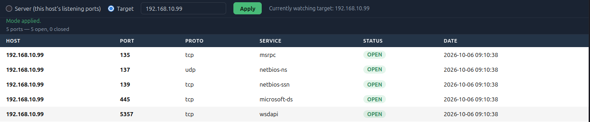
    </td>
  </tr>
</table>

##### Ports Displayed

<table width="100%">
  <tr>
    <td style="width: 50%; vertical-align: top;">
      <strong>Open ports and recently closed ports:</strong> <code>listPorts</code> returns all currently <strong>open</strong> ports and <strong>closed</strong> ports from the last 6 hours. This is the same period that <code>nwatchports.sh</code> uses to remove old closed rows (<code>PURGE_CLOSED_AFTER_HOURS</code>). As a result, the UI's <code>Closed</code> filter matches the rows in <code>port_scan_state</code> and does not show stale data. Without this limit, Server mode could add thousands of short-lived ports each day from mDNS/SSDP discovery, browser helper processes, and even this project's <code>nbtscan</code> calls. That buildup made the Ports tab take several seconds to create the table. Older events are excluded from this view but remain available in <code>port_events</code>.
    </td>
    <td style="width: 50%; vertical-align: top;">
      <strong>Puertos abiertos y puertos cerrados recientes:</strong> <code>listPorts</code> devuelve todos los puertos <strong>abiertos</strong> y los <strong>cerrados</strong> durante las últimas 6 horas. Es el mismo periodo que usa <code>nwatchports.sh</code> para eliminar filas cerradas antiguas (<code>PURGE_CLOSED_AFTER_HOURS</code>). Así, el filtro <code>Closed</code> muestra los registros que siguen en <code>port_scan_state</code>, sin datos antiguos. Sin este límite, el modo Server podría acumular miles de puertos efímeros al día por el descubrimiento mDNS/SSDP, los procesos auxiliares del navegador e incluso las llamadas a <code>nbtscan</code> de este proyecto. Esa acumulación hacía que la pestaña Ports tardara varios segundos en crear la tabla. Los eventos anteriores no aparecen en esta vista, pero siguen disponibles en <code>port_events</code>.
    </td>
  </tr>
</table>

##### Target Mode Authorization

<table width="100%">
  <tr>
    <td style="width: 50%; vertical-align: top;">
      <strong>Target mode performs an active port scan.</strong> Use it only on hosts you own or have explicit permission to audit. The same requirement applies to the Nmap-based Windows and Linux tools described above.
    </td>
    <td style="width: 50%; vertical-align: top;">
      <strong>El modo Target realiza un escaneo activo de puertos.</strong> Úselo solo con hosts propios o que tenga autorización expresa para auditar. Este requisito también aplica a las herramientas para Windows y Linux basadas en Nmap, descritas arriba.
    </td>
  </tr>
</table>

#### ⚠️ WARNING: Network Access

<table width="100%">
  <tr>
    <td style="width: 50%; vertical-align: top;">
      NWatch is designed for local use and access over a LAN. Do not expose it directly to the internet; it lacks the protections required for public-facing deployments. If you still need remote access, use an on-demand tunnel instead of opening ports directly.
    </td>
    <td style="width: 50%; vertical-align: top;">
      NWatch está diseñado para ejecutarse localmente y accederse desde una LAN. No lo exponga directamente a internet; carece de las protecciones necesarias para un servicio público. Si necesita acceso remoto, use un túnel bajo demanda en vez de abrir puertos directamente.
    </td>
  </tr>
</table>

> **CSRF protection:** The Ports tab's mode-switch form does not require a login; guest access across the LAN is intentional. The state-changing POST request includes a per-session CSRF token. The server accepts the request only when the form was loaded from the page first.
>
> **Protección CSRF:** El formulario para cambiar de modo en la pestaña Ports no requiere iniciar sesión; el acceso de invitado en toda la LAN es intencional. La solicitud POST que cambia el estado incluye un token CSRF por sesión. El servidor solo la acepta si el formulario se cargó antes desde la página.

**Optional tunnel:**
- [Cloudflare Tunnel with Zero Trust Recommended](https://raw.githubusercontent.com/maravento/vault/master/scripts/bash/cftunnel.sh)

## NOTICE

---

<table width="100%">
  <tr>
    <td style="width: 50%; vertical-align: top;">
      <strong>This repository</strong>
      <ul>
        <li>May include third-party components.</li>
        <li>Does not accept Pull Requests. Changes must be proposed via Issues.</li>
      </ul>
    </td>
    <td style="width: 50%; vertical-align: top;">
      <strong>Este repositorio</strong>
      <ul>
        <li>Puede incluir componentes de terceros.</li>
        <li>No acepta Pull Requests. Los cambios deben proponerse mediante Issues.</li>
      </ul>
    </td>
  </tr>
</table>

## DISCLAIMER

---

THE SOFTWARE IS PROVIDED "AS IS", WITHOUT WARRANTY OF ANY KIND, EXPRESS OR IMPLIED, INCLUDING BUT NOT LIMITED TO THE WARRANTIES OF MERCHANTABILITY, FITNESS FOR A PARTICULAR PURPOSE AND NONINFRINGEMENT. IN NO EVENT SHALL THE AUTHORS OR COPYRIGHT HOLDERS BE LIABLE FOR ANY CLAIM, DAMAGES OR OTHER LIABILITY, WHETHER IN AN ACTION OF CONTRACT, TORT OR OTHERWISE, ARISING FROM, OUT OF OR IN CONNECTION WITH THE SOFTWARE OR THE USE OR OTHER DEALINGS IN THE SOFTWARE.
